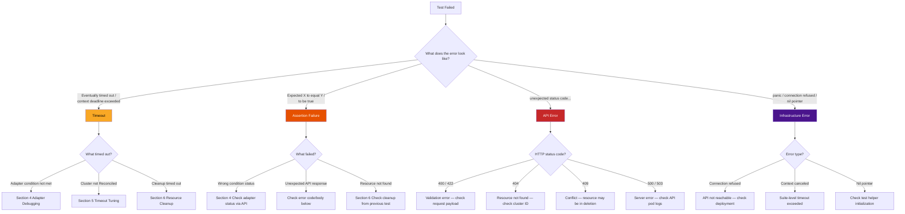
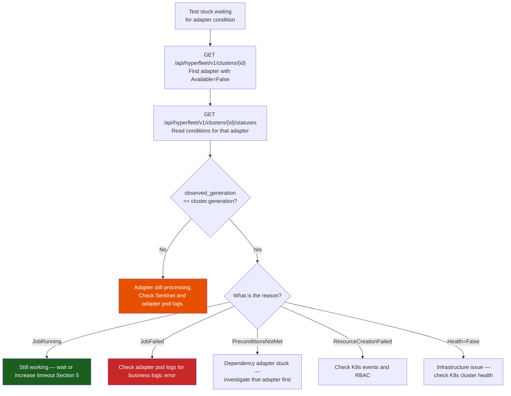
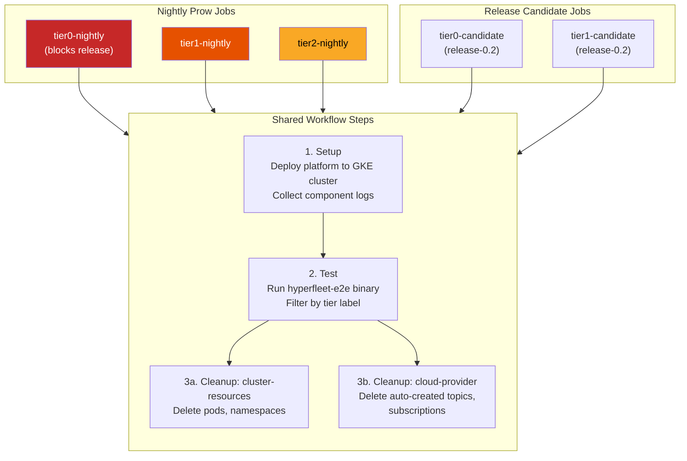

# Quick Reference Handbook: Debugging E2E Test Failures

This guide provides a systematic approach to diagnosing E2E test failures in the HyperFleet test suite. It is intended for any developer investigating a failing test, whether in CI or locally.

For guidance on **writing** tests, see [development.md](development.md). For **running** tests, see [getting-started.md](getting-started.md). For operational troubleshooting of deployed components (pod timeouts, API connectivity, k9s), see the [runbook.md troubleshooting section](runbook.md#common-failure-modes-and-troubleshooting).

---

## Table of Contents

1. [System Overview](#1-system-overview)
2. [Failure Triage Flowchart](#2-failure-triage-flowchart)
3. [Log Interpretation](#3-log-interpretation)
4. [Adapter Debugging](#4-adapter-debugging)
5. [Timeout Tuning](#5-timeout-tuning)
6. [Resource Cleanup Troubleshooting](#6-resource-cleanup-troubleshooting)
7. [CI Failure Debugging](#7-ci-failure-debugging)
8. [Common Patterns](#8-common-patterns)
9. [Quick Reference](#9-quick-reference)

---

## 1. System Overview

For HyperFleet's architecture, component descriptions, and system diagrams, see the [architecture repo](https://github.com/openshift-hyperfleet/architecture). The key flow for E2E tests is: test creates a cluster via the API → Sentinel detects it and publishes a CloudEvent → Adapters process independently and report status → API aggregates conditions → test polls until `Reconciled=True`.

For the test structure (BeforeEach/AfterEach lifecycle, code examples, payload templates), see [development.md](development.md). If a test fails with a validation error (`HYPERFLEET-VAL-*`), check the payload file in `testdata/payloads/` for missing or invalid fields.

---

## 2. Failure Triage Flowchart

When a test fails, start by classifying the failure type from the Ginkgo output.

### Decision Tree



### Reading Ginkgo Output

Ginkgo reports failures with the full `Describe/Context/It` path. Here is an example of what a timeout failure looks like:

```text
[FAILED] Timed out after 300.012s.
The function passed to Eventually never succeeded.

Expected:
    <bool>: false
to be true

At: /path/to/hyperfleet-e2e/e2e/cluster/creation.go:87

  Describe: Cluster lifecycle
    Context: when creating a new cluster
      It: should reach Reconciled=True for all adapters
------------------------------

Full Stack Trace:
  ...
  helper/pollers.go:14
  e2e/cluster/creation.go:87
------------------------------
```

What to look for:

- **`[FAILED]`** — the failing test spec
- **`Timed out after`** — `Eventually` exceeded its timeout. The last observed state is shown (e.g., `<bool>: false` means the condition was still not met).
- **`Expected ... to be true`** — the assertion that failed. Read the source line (e.g., `creation.go:87`) to see what condition was being checked.
- **`Describe / Context / It`** — the full test path, useful for identifying which test and scenario failed.
- **Stack trace** — follow it to the helper function (e.g., `pollers.go:14`) to understand which polling function timed out.

### API Error Format

The API returns errors following RFC 9457 Problem Details with codes like `HYPERFLEET-VAL-001`. For the full error model and category reference, see the [error model standard](https://github.com/openshift-hyperfleet/architecture/blob/main/hyperfleet/standards/error-model.md) in the architecture repo.

### How Errors Surface in Test Output

The E2E client's `handleHTTPResponse` function (`pkg/client/client.go`) converts all non-expected HTTP responses into **plain string errors**. This is important for debugging because the API returns structured RFC 9457 JSON, but by the time it reaches your test output, it's a single flat string:

```text
unexpected status code 404 for get cluster: {"code":"HYPERFLEET-NTF-002","detail":"cluster not found",...}
```

The implication: you cannot programmatically distinguish error types in test assertions — a 404 and a 500 both surface as `fmt.Errorf(...)` strings. When reading test output, look for:

1. **The HTTP status code** at the start (`unexpected status code 404`)
2. **The action** that failed (`for get cluster`)
3. **The embedded JSON** — parse it visually to find `code` (e.g., `HYPERFLEET-NTF-002`) and `detail` for the specific error

For validation errors (400/422), the embedded JSON may include a field-level `errors` array showing exactly which fields failed:

```text
unexpected status code 400 for create cluster: {"code":"HYPERFLEET-VAL-001",...,"errors":[{"field":"spec.name","constraint":"required","message":"Cluster name is required"}]}
```

---

## 3. Log Interpretation

### Logging Framework

The E2E framework uses Go's `slog` with a custom `GinkgoLogHandler` that automatically injects the current test case context (spec name, node index) into every log line.

### Configuration

| Flag | Env Var | Default | Values |
|------|---------|---------|--------|
| `--log-level` | `HYPERFLEET_LOG_LEVEL` | `info` | `debug`, `info`, `warn`, `error` |
| `--log-format` | `HYPERFLEET_LOG_FORMAT` | `text` | `text`, `json` |
| `--log-output` | `HYPERFLEET_LOG_OUTPUT` | `stdout` | `stdout`, `stderr` |

JSON is the team-standard format for production components. For local debugging, `text` format is more readable.

### Enabling Debug Output

```bash
make e2e HYPERFLEET_LOG_LEVEL=debug HYPERFLEET_LOG_FORMAT=json
```

### Correlating Test Logs with Component Logs

When investigating a failure that involves multiple components:

1. Note the **cluster ID** and **timestamp** from the test log
2. Check API logs for the corresponding request: filter by cluster ID
3. Check Sentinel logs for event publication: look for `sentinel.evaluate` spans
4. Check Adapter logs for task execution: filter by cluster ID and adapter name

Use structured log fields (`cluster_id`, `adapter`, `generation`, `trace_id`) to correlate across services. For the full field reference, see the [logging specification](https://github.com/openshift-hyperfleet/architecture/blob/main/hyperfleet/standards/logging-specification.md) in the architecture repo.

### Tip: Broker Log Level

The message broker produces excessive output at `debug` level. If debugging broker-related issues, start at `info` level and only drop to `debug` if needed.

---

## 4. Adapter Debugging

### Adapter Conditions and Status Model

For condition types (Applied, Available, Health, Finalized), their meanings, status lifecycle, and how they aggregate into cluster-level Reconciled/LastKnownReconciled, see:

- [Adapter status contract](https://github.com/openshift-hyperfleet/architecture/blob/main/hyperfleet/components/adapter/framework/adapter-status-contract.md)
- [Status guide](https://github.com/openshift-hyperfleet/architecture/blob/main/hyperfleet/docs/status-guide.md)

### Investigating a Stuck Adapter



### Example: Reading the Statuses Response

`GET /api/hyperfleet/v1/clusters/{id}/statuses` returns detailed per-adapter conditions:

```json
{
  "items": [
    {
      "adapter": "cl-namespace",
      "observed_generation": 1,
      "observed_time": "2026-05-08T10:30:00Z",
      "conditions": [
        { "type": "Applied",   "status": "True",  "reason": "ResourcesCreated" },
        { "type": "Available", "status": "True",  "reason": "JobSucceeded" },
        { "type": "Health",    "status": "True",  "reason": "NoErrors" }
      ]
    },
    {
      "adapter": "cl-job",
      "observed_generation": 1,
      "observed_time": "2026-05-08T10:30:05Z",
      "conditions": [
        { "type": "Applied",   "status": "True",  "reason": "ResourcesCreated" },
        { "type": "Available", "status": "False", "reason": "JobRunning",
          "message": "Validation Job is executing" },
        { "type": "Health",    "status": "True",  "reason": "NoErrors" }
      ]
    }
  ]
}
```

In this example, `cl-job` is the stuck adapter — its `Available` is `False` with reason `JobRunning`. The cluster won't reach `Reconciled=True` until this adapter completes.

### Adapter Execution Phases, Maestro, and Debug Commands

For adapter execution phases (ParamExtraction → Preconditions → Resources → PostActions), Maestro/ManifestWork troubleshooting, RBAC checks, and error messages, see:

- [Adapter runbook](https://github.com/openshift-hyperfleet/hyperfleet-adapter/blob/main/docs/runbook.md) — error messages, failure modes, and recovery procedures
- [Adapter framework design](https://github.com/openshift-hyperfleet/architecture/blob/main/hyperfleet/components/adapter/framework/adapter-frame-design.md) — execution phases and architecture
- [maestro-cli](https://github.com/openshift-hyperfleet/maestro-cli/) — terminal UI for inspecting Maestro resources

**Note:** Maestro does not support OpenTelemetry — tracing stops at the gRPC boundary.

---

## 5. Timeout Tuning

For timeout configuration, env var overrides, and default values, see the [runbook troubleshooting section](runbook.md#common-failure-modes-and-troubleshooting) and `configs/config.yaml`.

### When to Increase vs. When to Fix

| Adapter Status | Reason | Action |
|----------------|--------|--------|
| `Available=False` | `JobRunning` | Timeout too short — increase it |
| `Available=False` | `JobFailed` | Fix the underlying issue |
| `Available=False` | `PreconditionsNotMet` | Dependency adapter stuck — investigate that adapter |
| No status reported | — | Adapter didn't receive event — check Sentinel and broker |

### Sentinel Reconciliation

If tests timeout waiting for an adapter, verify the Sentinel is publishing events. Check `hyperfleet_sentinel_events_published_total` and `hyperfleet_sentinel_pending_resources` metrics on the Sentinel pod. For Sentinel TTLs and reconciliation behavior, see [sentinel pulses](https://github.com/openshift-hyperfleet/architecture/blob/main/hyperfleet/docs/sentinel-pulses.md).

### Adjusting Timeouts for Local Debugging

```bash
HYPERFLEET_TIMEOUTS_CLUSTER_RECONCILED=45m \
HYPERFLEET_TIMEOUTS_ADAPTER_PROCESSING=10m \
HYPERFLEET_POLLING_INTERVAL=5s \
make e2e
```

---

## 6. Resource Cleanup Troubleshooting

### Test Cleanup Flow

Each test's `AfterEach` calls `CleanupTestCluster()` which deletes Maestro ManifestWorks then K8s namespaces. Errors are accumulated, not short-circuited. For the full cleanup lifecycle, see [architecture.md](architecture.md).

### Detecting Test Pollution

If a test fails during cleanup, leftover resources may affect subsequent tests. Signs of pollution:

- Test fails with "resource already exists"
- Unexpected adapter conditions from a previous test's cluster
- Namespace collision (cluster ID reuse)
- **Helm ownership conflict** (most common in CI): `invalid ownership metadata; annotation validation error: key "meta.helm.sh/release-namespace" must equal "e2e-<NEW>": current value is "e2e-<OLD>"` — this means cluster-scoped resources (like ClusterRoles) from a previous run still exist and are owned by a different Helm release namespace

To fix a Helm ownership conflict, delete the stale ClusterRole:

```bash
kubectl get clusterroles | grep adapter-
kubectl delete clusterrole adapter-clusters-cl-job adapter-clusters-cl-deployment adapter-clusters-cl-namespace
```

Check for orphaned resources:

```bash
# Find orphaned namespaces
kubectl get namespaces | grep -E '^e2e-|^test-'

# Find orphaned ManifestWorks
kubectl get appliedmanifestworks -A

# Check for leftover pods
kubectl get pods -A | grep hyperfleet
```

### Manual Cleanup

```bash
# Delete a specific test namespace
kubectl delete namespace <namespace-name> --wait=true

# Delete all test namespaces matching a pattern
kubectl get namespaces -o name | grep 'e2e-test' | xargs kubectl delete

# Delete ManifestWorks for a specific cluster
kubectl delete appliedmanifestwork -n <namespace> --all
```

#### Maestro resources

In case maestro DB is populated with many manifestworks, it can be time intensive to delete them all.
Deleting the appliedmanifestworks k8s objects is not the solution, since maestro will recreate them from the DB data.
In this case, it can be more convenient to uninstall maestro and install it again.

As reference, deleting 777 maestro entries took >30min in GKE prow cluster

### Deletion Flow (Production)

For the full production deletion lifecycle (mark → Sentinel → Adapter cleanup → Finalized → hard delete), see the [adapter deletion flow design](https://github.com/openshift-hyperfleet/architecture/blob/main/hyperfleet/components/adapter/framework/adapter-deletion-flow-design.md) in the architecture repo.

---

## 7. CI Failure Debugging

### Prow Workflow

The E2E CI runs as tier-specific nightly Prow jobs, each executing the same workflow:



**Current nightly jobs on `main`:**

| Job | Label Filter | Schedule |
|-----|-------------|----------|
| `periodic-ci-openshift-hyperfleet-hyperfleet-e2e-main-e2e-tier0-nightly` | `tier0` | Daily |
| `periodic-ci-openshift-hyperfleet-hyperfleet-e2e-main-e2e-tier1-nightly` | `tier1` | Daily |
| `periodic-ci-openshift-hyperfleet-hyperfleet-e2e-main-e2e-tier2-nightly` | `tier2` | Daily |

**Release candidate jobs on `release-0.2`:**

| Job | Label Filter |
|-----|-------------|
| `periodic-ci-openshift-hyperfleet-hyperfleet-e2e-release-0.2-e2e-tier0-candidate` | `tier0` |
| `periodic-ci-openshift-hyperfleet-hyperfleet-e2e-release-0.2-e2e-tier1-candidate` | `tier1` |

The setup step deploys the HyperFleet platform to the shared GKE cluster, stores the external API IP, and **captures component logs** (API, Sentinel, Adapters, PostgreSQL) as artifacts for post-failure debugging.

### Finding and Viewing Job Results

1. Navigate to the [Prow dashboard](https://prow.ci.openshift.org/)
2. Filter by job name: `*hyperfleet-e2e-main-e2e-tier*` (matches all tier nightlies)
3. Click on the latest job run to view the build log
4. Click **Artifacts** in the Prow job page to open the [GCS browser](https://gcsweb-ci.apps.ci.l2s4.p1.openshiftapps.com). Navigate to the workflow steps:

   ```text
   <job-run-id>/
   ├── build-log.txt                         # Top-level ci-operator log
   ├── artifacts/
   │   ├── ci-operator.log
   │   ├── junit_operator.xml
   │   └── <tier>-nightly/                   # e.g. tier0-nightly, tier1-nightly
   │       ├── openshift-hyperfleet-e2e-setup/
   │       │   ├── build-log.txt             # Setup step log (deploy script output)
   │       │   └── artifacts/                # Component logs captured here
   │       │       ├── api-hyperfleet-api-*-logs.txt
   │       │       ├── sentinel-clusters-*-logs.txt
   │       │       ├── adapter-clusters-cl-*-logs.txt
   │       │       └── all-resources.txt     # Full K8s resource dump
   │       ├── openshift-hyperfleet-e2e-test/
   │       │   ├── build-log.txt             # Test output (Ginkgo results)
   │       │   └── artifacts/
   │       │       └── junit.xml             # JUnit test report
   │       ├── openshift-hyperfleet-e2e-cleanup-cluster-resources/
   │       │   └── build-log.txt
   │       └── openshift-hyperfleet-e2e-cleanup-cloud-provider/
   │           └── build-log.txt
   └── build-logs/                           # Image build logs
   ```

5. When a test fails, check `<tier>-nightly/openshift-hyperfleet-e2e-setup/artifacts/` for captured component logs — these show API, Sentinel, and Adapter output at the time of the test run

### Triggering a Manual Rerun

**From the Prow dashboard:** Click the **Rerun** button on the job page. Don't click it repeatedly — it takes a few seconds to register.

**From the command line (gangway API):**

```bash
# Trigger tier0 nightly (replace with tier1 or tier2 as needed)
curl -v -X POST \
  -H "Authorization: Bearer $(oc whoami -t)" \
  -d '{"job_name": "periodic-ci-openshift-hyperfleet-hyperfleet-e2e-main-e2e-tier0-nightly", "job_execution_type": "1"}' \
  https://gangway-ci.apps.ci.l2s4.p1.openshiftapps.com/v1/executions
```

### Debugging in the Prow Environment

**Login to the test cluster:** In the build log, click the namespace link (e.g., `https://console-openshift-console.apps...`) to access the test cluster's console.

**Debug trick — pause execution:** To keep the Prow environment alive for live investigation, submit a PR to the [openshift/release](https://github.com/openshift/release) repo that adds a `sleep` command to the E2E workflow test step. While the job is paused, click the namespace link in the build log (e.g., `https://console-openshift-console.apps.build03...`) to open the OpenShift console, then use `oc` to inspect the running pods and resources. See the [Prow setup guide](https://github.com/openshift-hyperfleet/architecture/blob/main/hyperfleet/docs/test-release/add-hyperfleet-e2e-ci-job-in-prow.md) for details on the workflow step definitions.

### Failure Categories

| Category | How to Identify | Action |
|----------|----------------|--------|
| Deployment script failure | Error in `setup` step logs (e.g., `context deadline exceeded` during Helm install) | Check pod status, resource limits, Helm chart configs. May indicate API pod not starting (check PostgreSQL, image pull) |
| Helm ownership conflict | `invalid ownership metadata` error in setup logs | Previous run left cluster-scoped resources. Delete stale ClusterRoles (see Section 6) |
| Test case failure | Error in `test` step logs with `[FAILED]` | Diagnose via Section 2-6 of this guide |
| Prow environment issue | Infra errors, networking, auth failures | Retrigger the job; if persistent, ask `#forum-ocp-testplatform` |

### Important CI Notes

- **Prow uses the commit status API**, not GitHub Checks. Tools querying `statusCheckRollup` will see null for Prow jobs.
- **Components are not independently releasable.** You cannot safely mix component versions from different points in time. If a nightly breaks, all components must be from the same commit window.
- Detailed Prow setup documentation: [add-hyperfleet-e2e-ci-job-in-prow.md](https://github.com/openshift-hyperfleet/architecture/blob/main/hyperfleet/docs/test-release/add-hyperfleet-e2e-ci-job-in-prow.md)

---

## 8. Common Patterns

### "Works Locally, Fails in CI"

- **Environment state:** CI deploys to a shared cluster. Previous test runs may leave residual resources. Verify the namespace is clean before assuming a code issue.
- **Background clusters:** Other clusters in the system affect Sentinel evaluation timing and adapter scheduling. Each additional cluster adds extra Sentinel evaluation cycles, which can change timing behavior compared to a clean local environment.
- **Timing differences:** CI environments may have different network latency, resource constraints, or pod scheduling delays. Consider increasing timeouts before investigating logic bugs.
- **Image versions:** Verify the CI job is using the expected image tags. Components are tested together from main — version mismatches cause failures.

### "Timeout on Cluster Reconciled"

This is the most common failure. Follow the [Investigating a Stuck Adapter](#investigating-a-stuck-adapter) flowchart in Section 4 — it walks through identifying the blocking adapter, reading the statuses response, and interpreting the reason code.

### "Test Passes Sometimes, Fails Others" (Flakiness)

Common flakiness sources:

- **Race conditions in concurrent tests:** Ensure goroutines use `sync.WaitGroup` and call `ginkgo.GinkgoRecover()`. Collect all resource IDs before assertions so cleanup runs even if assertions fail.
- **Timing sensitivity:** If the test polls faster than the system can process, it may catch intermediate states. Use appropriate `Eventually` timeouts and polling intervals.
- **Resource name collisions:** Test-generated resource names should include unique identifiers (timestamps, random suffixes) to prevent conflicts between parallel runs.
- **Available vs Unknown during transitions:** During adapter execution, the initial `Available=Unknown` is valid only for the first report. Subsequent `Unknown` reports are discarded by the API. Don't assert on `Unknown` in tests.

### Codespace / Dev Environment Issues

- **Pods crash-loop after hibernation:** After a Codespace wakes from sleep, pods may crash-loop. Restart all deployments: `kubectl rollout restart deployment -n <ns>`
- **Port-forwards die after hibernation:** Re-establish port-forwards after resuming.
- **Always verify clean state** before running tests in a dev environment.

---

## 9. Quick Reference

For helper functions (pollers, matchers, validation helpers), see [architecture.md](architecture.md). For Makefile targets, test labels, running specific tests, and kubectl commands, see the [runbook](runbook.md) and [development guide](development.md).

### External Resources

- **Slack:** `#hyperfleet-e2e-status` — E2E test status and notifications
- **Prow dashboard:** [prow.ci.openshift.org](https://prow.ci.openshift.org/)
- **Prow setup guide:** [add-hyperfleet-e2e-ci-job-in-prow.md](https://github.com/openshift-hyperfleet/architecture/blob/main/hyperfleet/docs/test-release/add-hyperfleet-e2e-ci-job-in-prow.md)
- **Architecture repo:** [openshift-hyperfleet/architecture](https://github.com/openshift-hyperfleet/architecture)
- **Status guide:** [status-guide.md](https://github.com/openshift-hyperfleet/architecture/blob/main/hyperfleet/docs/status-guide.md)
- **Adapter status contract:** [adapter-status-contract.md](https://github.com/openshift-hyperfleet/architecture/blob/main/hyperfleet/components/adapter/framework/adapter-status-contract.md)
