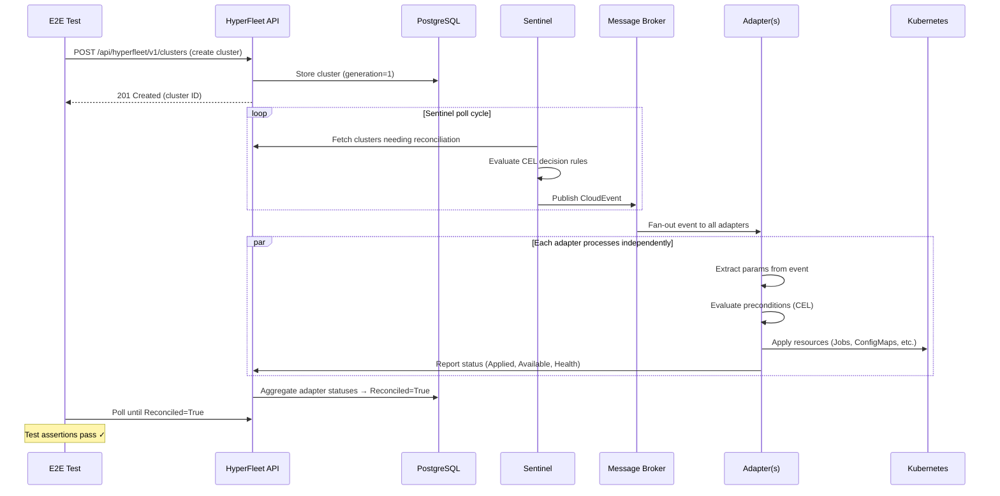
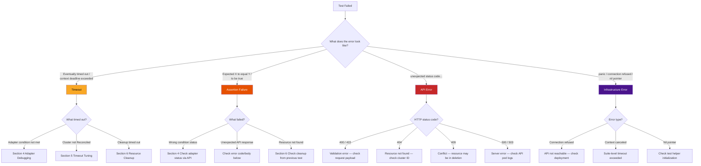
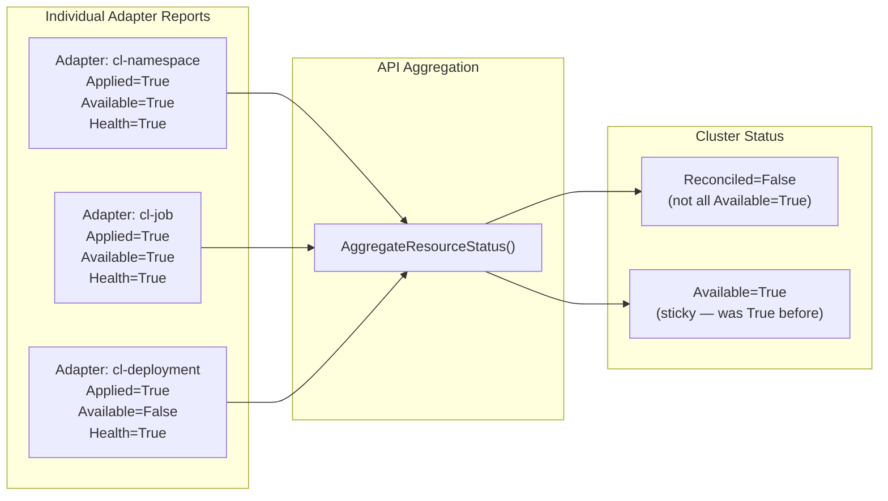
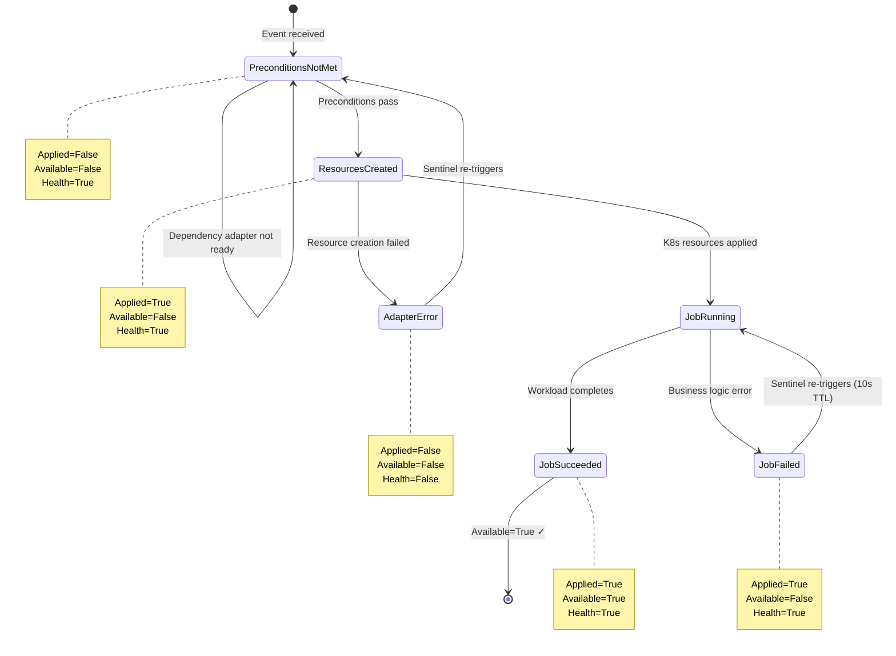
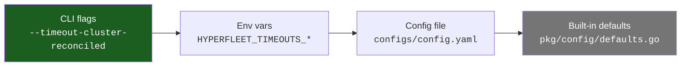
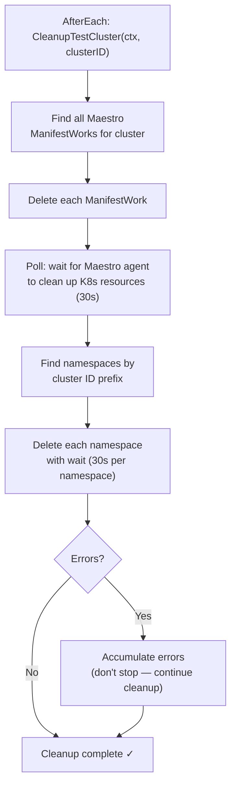
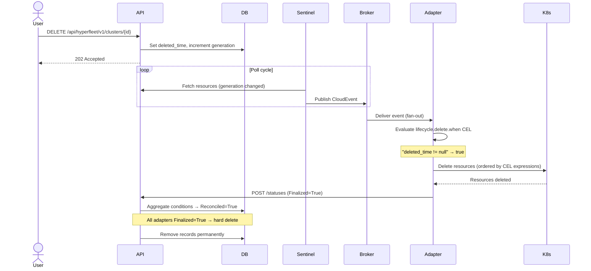
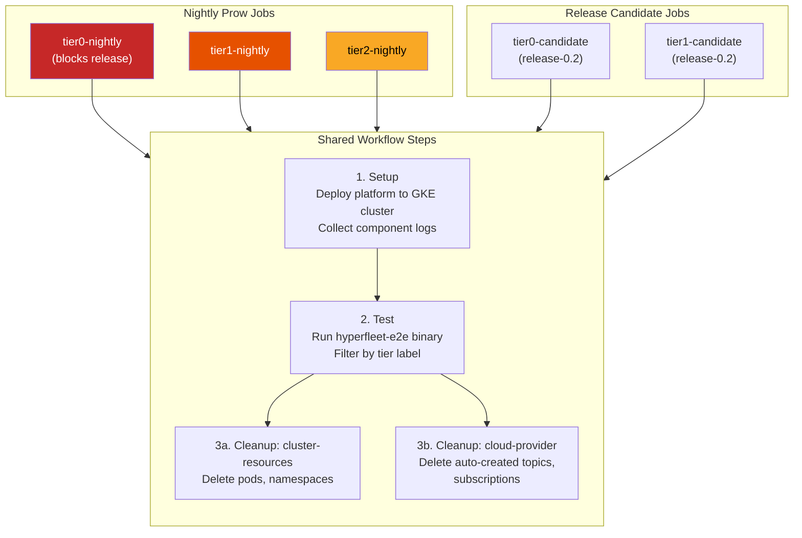

# Quick Reference Handbook: Debugging E2E Test Failures

This guide provides a systematic approach to diagnosing E2E test failures in the HyperFleet test suite. It is intended for any developer investigating a failing test, whether in CI or locally.

For guidance on **writing** tests, see [development.md](development.md). For **running** tests, see [getting-started.md](getting-started.md). For operational troubleshooting of deployed components (pod timeouts, API connectivity, k9s), see the [runbook.md troubleshooting section](runbook.md#common-failure-modes-and-troubleshooting).

---

## Table of Contents

1. [System Overview](#1-system-overview)
2. [Failure Triage Flowchart](#2-failure-triage-flowchart)
3. [Log Interpretation](#3-log-interpretation)
4. [Adapter Debugging](#4-adapter-debugging)
5. [Timeout Tuning](#5-timeout-tuning)
6. [Resource Cleanup Troubleshooting](#6-resource-cleanup-troubleshooting)
7. [CI Failure Debugging](#7-ci-failure-debugging)
8. [Common Patterns](#8-common-patterns)
9. [Tools and Commands Quick Reference](#9-tools-and-commands-quick-reference)


---

## 1. System Overview

### How HyperFleet Works

HyperFleet is an event-driven cluster lifecycle management platform. When a test creates a cluster, several components coordinate to make it operational:



### Key Components

| Component | Role | What to check when debugging |
|-----------|------|------------------------------|
| **API** | REST service storing clusters, nodepools, and adapter statuses in PostgreSQL | Request/response errors, status aggregation |
| **Sentinel** | Stateless poller that detects resources needing reconciliation and publishes CloudEvents | Event publication, poll intervals, label selectors |
| **Broker** | Message bus (GCP Pub/Sub or RabbitMQ) that fans out events to all adapters | Message delivery, topic/subscription config |
| **Adapter** | Event processor that applies K8s resources and reports status back to the API | Condition values, execution phases, CEL expressions |
| **Maestro** | Cross-cluster resource delivery via ManifestWork (used by some adapters) | ManifestWork status, gRPC connectivity |

### How a Test is Structured

> For detailed guidance on writing tests, see [development.md](development.md). The summary below covers the pattern you need to understand when debugging.

Every E2E test follows this lifecycle pattern:

```go
Describe("Cluster", func() {
    var h *helper.Helper
    var clusterID string

    BeforeEach(func() {
        h = helper.New()                                    // Initialize helper with config, API client, K8s client
    })

    AfterEach(func() {
        h.CleanupTestCluster(ctx, clusterID)                // Delete ManifestWorks + namespaces
    })

    It("should create a cluster and reach Reconciled", func() {
        // 1. Create cluster from JSON payload template
        clusterID, err = h.GetTestCluster(ctx, "testdata/payloads/clusters/cluster-request.json")

        // 2. Wait for all adapters to complete
        err = h.WaitForClusterCondition(ctx, clusterID,
            "Reconciled", openapi.ResourceConditionStatusTrue,
            h.Cfg.Timeouts.Cluster.Reconciled)

        // 3. Assert final state
        cluster, _ := h.Client.GetCluster(ctx, clusterID)
        Expect(h.HasResourceCondition(cluster.Status.Conditions,
            "Available", openapi.ResourceConditionStatusTrue)).To(BeTrue())
    })
})
```

### Payload Templates

> For payload template syntax and Go template variables, see the [Payload Templates section in development.md](development.md). The summary below covers what you need for debugging.

Tests create clusters from JSON payloads stored in `testdata/payloads/`. These files support template variables for dynamic naming:

```text
testdata/
└── payloads/
    ├── clusters/       # Cluster creation payloads
    │   └── cluster-request.json
    └── nodepools/      # NodePool creation payloads
        └── nodepool-request.json
```

If a test fails with a validation error (`HYPERFLEET-VAL-*`), check the payload file for missing or invalid fields. The payload is sent directly to `POST /api/hyperfleet/v1/clusters`, so the fields must match the API spec.

---

## 2. Failure Triage Flowchart

When a test fails, start by classifying the failure type from the Ginkgo output.

### Decision Tree



### Reading Ginkgo Output

Ginkgo reports failures with the full `Describe/Context/It` path. Here is an example of what a timeout failure looks like:

```text
[FAILED] Timed out after 300.012s.
The function passed to Eventually never succeeded.

Expected:
    <bool>: false
to be true

At: /path/to/hyperfleet-e2e/e2e/cluster/creation.go:87

  Describe: Cluster lifecycle
    Context: when creating a new cluster
      It: should reach Reconciled=True for all adapters
------------------------------

Full Stack Trace:
  ...
  helper/wait.go:25
  e2e/cluster/creation.go:87
------------------------------
```

What to look for:

- **`[FAILED]`** — the failing test spec
- **`Timed out after`** — `Eventually` exceeded its timeout. The last observed state is shown (e.g., `<bool>: false` means the condition was still not met).
- **`Expected ... to be true`** — the assertion that failed. Read the source line (e.g., `creation.go:87`) to see what condition was being checked.
- **`Describe / Context / It`** — the full test path, useful for identifying which test and scenario failed.
- **Stack trace** — follow it to the helper function (e.g., `wait.go:25`) to understand which wait condition timed out.

### API Error Format

The HyperFleet API returns errors following RFC 9457 Problem Details:

```json
{
  "type": "https://api.hyperfleet.io/errors/validation-error",
  "title": "Validation Error",
  "status": 400,
  "detail": "Cluster name is required",
  "code": "HYPERFLEET-VAL-001",
  "trace_id": "4bf92f3577b34da6a3ce929d0e0e4736"
}
```

Error code format: `HYPERFLEET-{CATEGORY}-{NUMBER}`

| Category | HTTP Status | Meaning |
|----------|-------------|---------|
| `VAL` | 400, 422 | Validation failure |
| `AUT` | 401 | Authentication failure |
| `AUZ` | 403 | Authorization failure |
| `NTF` | 404 | Resource not found |
| `CNF` | 409 | Conflict (e.g., resource being deleted) |
| `INT` | 500 | Internal server error |
| `SVC` | 502, 503, 504 | Service unavailable |

### How Errors Surface in Test Output

The E2E client's `handleHTTPResponse` function (`pkg/client/client.go`) converts all non-expected HTTP responses into **plain string errors**. This is important for debugging because the API returns structured RFC 9457 JSON, but by the time it reaches your test output, it's a single flat string:

```text
unexpected status code 404 for get cluster: {"code":"HYPERFLEET-NTF-002","detail":"cluster not found",...}
```

The implication: you cannot programmatically distinguish error types in test assertions — a 404 and a 500 both surface as `fmt.Errorf(...)` strings. When reading test output, look for:

1. **The HTTP status code** at the start (`unexpected status code 404`)
2. **The action** that failed (`for get cluster`)
3. **The embedded JSON** — parse it visually to find `code` (e.g., `HYPERFLEET-NTF-002`) and `detail` for the specific error

For validation errors (400/422), the embedded JSON may include a field-level `errors` array showing exactly which fields failed:

```text
unexpected status code 400 for create cluster: {"code":"HYPERFLEET-VAL-001",...,"errors":[{"field":"spec.name","constraint":"required","message":"Cluster name is required"}]}
```

---

## 3. Log Interpretation

### Logging Framework

The E2E framework uses Go's `slog` with a custom `GinkgoLogHandler` that automatically injects the current test case context (spec name, node index) into every log line.

### Configuration

| Flag | Env Var | Default | Values |
|------|---------|---------|--------|
| `--log-level` | `HYPERFLEET_LOG_LEVEL` | `info` | `debug`, `info`, `warn`, `error` |
| `--log-format` | `HYPERFLEET_LOG_FORMAT` | `text` | `text`, `json` |
| `--log-output` | `HYPERFLEET_LOG_OUTPUT` | `stdout` | `stdout`, `stderr` |

JSON is the team-standard format for production components. For local debugging, `text` format is more readable.

### Enabling Debug Output

```bash
make e2e HYPERFLEET_LOG_LEVEL=debug HYPERFLEET_LOG_FORMAT=json
```

### Correlating Test Logs with Component Logs

When investigating a failure that involves multiple components:

1. Note the **cluster ID** and **timestamp** from the test log
2. Check API logs for the corresponding request: filter by cluster ID
3. Check Sentinel logs for event publication: look for `sentinel.evaluate` spans
4. Check Adapter logs for task execution: filter by cluster ID and adapter name

Structured log fields to look for:

| Field | Where | Purpose |
|-------|-------|---------|
| `cluster_id` | All components | Correlate across services |
| `adapter` | Adapter logs | Identify which adapter |
| `generation` | API, Adapter | Track spec version |
| `observed_generation` | Adapter status | Confirm adapter processed latest spec |
| `trace_id` | API responses | End-to-end request tracing |

### Tip: Broker Log Level

The message broker produces excessive output at `debug` level. If debugging broker-related issues, start at `info` level and only drop to `debug` if needed.

---

## 4. Adapter Debugging

### Adapter Conditions

Every adapter reports three required conditions on each status update:

| Condition | Meaning when `True` | Meaning when `False` |
|-----------|---------------------|----------------------|
| **Applied** | Resources have been created/applied to K8s | Resources not applied (preconditions not met, creation failed) |
| **Available** | Adapter completed its work successfully | Work in progress, failed, or not started |
| **Health** | No unexpected errors | Adapter encountered infrastructure errors |

During **deletion**, a fourth condition is required:

| Condition | Meaning when `True` | Meaning when `False` |
|-----------|---------------------|----------------------|
| **Finalized** | All managed resources deleted and verified | Cleanup in progress or failed |

### Resource-Level Conditions

At the cluster/nodepool level, the API computes aggregate conditions from individual adapter reports:



| Condition | How It's Computed |
|-----------|-------------------|
| **Reconciled** | All required adapters report `Available=True` at current generation (normal lifecycle) **OR** all adapters report `Finalized=True` (during deletion) |
| **Available** | Uses "sticky" logic — stays `True` during generation transitions until all adapters report at new generation |

### Status Lifecycle



### Investigating a Stuck Adapter


### Example: Reading the Statuses Response

`GET /api/hyperfleet/v1/clusters/{id}/statuses` returns detailed per-adapter conditions:

```json
{
  "items": [
    {
      "adapter": "cl-namespace",
      "observed_generation": 1,
      "observed_time": "2026-05-08T10:30:00Z",
      "conditions": [
        { "type": "Applied",   "status": "True",  "reason": "ResourcesCreated" },
        { "type": "Available", "status": "True",  "reason": "JobSucceeded" },
        { "type": "Health",    "status": "True",  "reason": "NoErrors" }
      ]
    },
    {
      "adapter": "cl-job",
      "observed_generation": 1,
      "observed_time": "2026-05-08T10:30:05Z",
      "conditions": [
        { "type": "Applied",   "status": "True",  "reason": "ResourcesCreated" },
        { "type": "Available", "status": "False", "reason": "JobRunning",
          "message": "Validation Job is executing" },
        { "type": "Health",    "status": "True",  "reason": "NoErrors" }
      ]
    }
  ]
}
```

In this example, `cl-job` is the stuck adapter — its `Available` is `False` with reason `JobRunning`. The cluster won't reach `Reconciled=True` until this adapter completes.

### Adapter Execution Phases

The adapter framework executes in four phases:

```text
ParamExtraction → Preconditions → Resources → PostActions
```

Failures are reported per-phase. When debugging adapter errors, identify which phase failed:

- **ParamExtraction** — Event parameters couldn't be parsed. Note: error messages may not show the specific env var that's missing (known limitation).
- **Preconditions** — Dependency conditions not met (e.g., another adapter hasn't completed). Check the CEL expression and the variables available in context (`params`, `resources.*`, `adapter.*`).
- **Resources** — K8s resource creation/update failed. Check RBAC, resource quotas, and manifest validity.
- **PostActions** — Status reporting or post-processing failed.

### Maestro/ManifestWork

For adapters using Maestro transport, note that **Maestro does not support OpenTelemetry**. Tracing stops at the gRPC boundary between the adapter and Maestro. To debug ManifestWork issues:

```bash
kubectl get manifestworks -A
kubectl describe manifestwork <name> -n <namespace>
```

### Adapter-Specific Debug Commands

> For general kubectl commands (pod logs, namespace checks, Helm), see [Section 9](#kubectl-commands-for-debugging).

```bash
# RBAC verification — can the adapter create the resources it needs?
kubectl auth can-i create jobs --as=system:serviceaccount:hyperfleet-system:hyperfleet-adapter-validation

# API connectivity from inside the adapter pod
kubectl exec -it <pod-name> -n hyperfleet-system -- \
  curl http://hyperfleet-api.hyperfleet-system.svc.cluster.local:8080/health

# Adapter metrics
curl http://<pod-ip>:9090/metrics
```

---

## 5. Timeout Tuning

### Configuration Priority

Timeouts follow the same [configuration priority](architecture.md) as all settings (highest wins):



### Default Timeouts

| Parameter | Default | Env Var |
|-----------|---------|---------|
| Cluster reconciled | 30m | `HYPERFLEET_TIMEOUTS_CLUSTER_RECONCILED` |
| NodePool reconciled | 30m | `HYPERFLEET_TIMEOUTS_NODEPOOL_RECONCILED` |
| Adapter processing | 5m | `HYPERFLEET_TIMEOUTS_ADAPTER_PROCESSING` |
| Polling interval | 10s | `HYPERFLEET_POLLING_INTERVAL` |

No external CI pipeline overrides these values — they are baked into the test binary configuration.

### When to Increase vs. When to Fix

| Adapter Status | Reason | Action |
|----------------|--------|--------|
| `Available=False` | `JobRunning` | Timeout too short — increase it |
| `Available=False` | `JobFailed` | Fix the underlying issue |
| `Available=False` | `PreconditionsNotMet` | Dependency adapter stuck — investigate that adapter |
| No status reported | — | Adapter didn't receive event — check Sentinel and broker |

### Sentinel Reconciliation TTLs

The Sentinel uses different TTLs for resource reconciliation:

| Scenario | TTL | Meaning |
|----------|-----|---------|
| Not reconciled (adapter processing) | 10s | Re-publish event quickly for in-progress work |
| Reconciled and stable | 30m | Periodic health check, low urgency |

If tests timeout waiting for an adapter, verify the Sentinel is publishing events. Check the [Sentinel metrics](#sentinel-metrics) in Section 9.

### Adjusting Timeouts for Local Debugging

```bash
HYPERFLEET_TIMEOUTS_CLUSTER_RECONCILED=45m \
HYPERFLEET_TIMEOUTS_ADAPTER_PROCESSING=10m \
HYPERFLEET_POLLING_INTERVAL=5s \
make e2e
```

---

## 6. Resource Cleanup Troubleshooting

### Test Cleanup Flow

Each test follows this cleanup pattern in `AfterEach`:



Errors during cleanup are accumulated, not short-circuited — the cleanup attempts to remove as much as possible.

### Detecting Test Pollution

If a test fails during cleanup, leftover resources may affect subsequent tests. Signs of pollution:

- Test fails with "resource already exists"
- Unexpected adapter conditions from a previous test's cluster
- Namespace collision (cluster ID reuse)
- **Helm ownership conflict** (most common in CI): `invalid ownership metadata; annotation validation error: key "meta.helm.sh/release-namespace" must equal "e2e-<NEW>": current value is "e2e-<OLD>"` — this means cluster-scoped resources (like ClusterRoles) from a previous run still exist and are owned by a different Helm release namespace

To fix a Helm ownership conflict, delete the stale ClusterRole:
```bash
kubectl get clusterroles | grep adapter-
kubectl delete clusterrole adapter-clusters-cl-job adapter-clusters-cl-deployment adapter-clusters-cl-namespace
```

Check for orphaned resources:

```bash
# Find orphaned namespaces
kubectl get namespaces | grep -E '^e2e-|^test-'

# Find orphaned ManifestWorks
kubectl get manifestworks -A

# Check for leftover pods
kubectl get pods -A | grep hyperfleet
```

### Manual Cleanup

```bash
# Delete a specific test namespace
kubectl delete namespace <namespace-name> --wait=true

# Delete all test namespaces matching a pattern
kubectl get namespaces -o name | grep 'e2e-test' | xargs kubectl delete

# Delete ManifestWorks for a specific cluster
kubectl delete manifestwork -n <namespace> --all
```

### Deletion Flow (Production)

The full HyperFleet deletion lifecycle:



Force deletion is a separate feature: "best effort cleanup resulting in manual cleanup of orphaned resources."

---

## 7. CI Failure Debugging

### Prow Workflow

The E2E CI runs as tier-specific nightly Prow jobs, each executing the same workflow:



**Current nightly jobs on `main`:**

| Job | Label Filter | Schedule |
|-----|-------------|----------|
| `periodic-ci-openshift-hyperfleet-hyperfleet-e2e-main-e2e-tier0-nightly` | `tier0` | Daily |
| `periodic-ci-openshift-hyperfleet-hyperfleet-e2e-main-e2e-tier1-nightly` | `tier1` | Daily |
| `periodic-ci-openshift-hyperfleet-hyperfleet-e2e-main-e2e-tier2-nightly` | `tier2` | Daily |

**Release candidate jobs on `release-0.2`:**

| Job | Label Filter |
|-----|-------------|
| `periodic-ci-openshift-hyperfleet-hyperfleet-e2e-release-0.2-e2e-tier0-candidate` | `tier0` |
| `periodic-ci-openshift-hyperfleet-hyperfleet-e2e-release-0.2-e2e-tier1-candidate` | `tier1` |

The setup step deploys the HyperFleet platform to the shared GKE cluster, stores the external API IP, and **captures component logs** (API, Sentinel, Adapters, PostgreSQL) as artifacts for post-failure debugging.

### Finding and Viewing Job Results

1. Navigate to the [Prow dashboard](https://prow.ci.openshift.org/)
2. Filter by job name: `*hyperfleet-e2e-main-e2e-tier*` (matches all tier nightlies)
3. Click on the latest job run to view the build log
4. Click **Artifacts** in the Prow job page to open the [GCS browser](https://gcsweb-ci.apps.ci.l2s4.p1.openshiftapps.com). Navigate to the workflow steps:
   ```text
   <job-run-id>/
   ├── build-log.txt                         # Top-level ci-operator log
   ├── artifacts/
   │   ├── ci-operator.log
   │   ├── junit_operator.xml
   │   └── <tier>-nightly/                   # e.g. tier0-nightly, tier1-nightly
   │       ├── openshift-hyperfleet-e2e-setup/
   │       │   ├── build-log.txt             # Setup step log (deploy script output)
   │       │   └── artifacts/                # Component logs captured here
   │       │       ├── api-hyperfleet-api-*-logs.txt
   │       │       ├── sentinel-clusters-*-logs.txt
   │       │       ├── adapter-clusters-cl-*-logs.txt
   │       │       └── all-resources.txt     # Full K8s resource dump
   │       ├── openshift-hyperfleet-e2e-test/
   │       │   ├── build-log.txt             # Test output (Ginkgo results)
   │       │   └── artifacts/
   │       │       └── junit.xml             # JUnit test report
   │       ├── openshift-hyperfleet-e2e-cleanup-cluster-resources/
   │       │   └── build-log.txt
   │       └── openshift-hyperfleet-e2e-cleanup-cloud-provider/
   │           └── build-log.txt
   └── build-logs/                           # Image build logs
   ```
5. When a test fails, check `<tier>-nightly/openshift-hyperfleet-e2e-setup/artifacts/` for captured component logs — these show API, Sentinel, and Adapter output at the time of the test run

### Triggering a Manual Rerun

**From the Prow dashboard:** Click the **Rerun** button on the job page. Don't click it repeatedly — it takes a few seconds to register.

**From the command line (gangway API):**
```bash
# Trigger tier0 nightly (replace with tier1 or tier2 as needed)
curl -v -X POST \
  -H "Authorization: Bearer $(oc whoami -t)" \
  -d '{"job_name": "periodic-ci-openshift-hyperfleet-hyperfleet-e2e-main-e2e-tier0-nightly", "job_execution_type": "1"}' \
  https://gangway-ci.apps.ci.l2s4.p1.openshiftapps.com/v1/executions
```

### Debugging in the Prow Environment

**Login to the test cluster:** In the build log, click the namespace link (e.g., `https://console-openshift-console.apps...`) to access the test cluster's console.

**Debug trick — pause execution:** To SSH into the Prow environment for live investigation, submit a PR that adds a `sleep` command to the test step. This holds the environment open while you inspect the state.

### Failure Categories

| Category | How to Identify | Action |
|----------|----------------|--------|
| Deployment script failure | Error in `setup` step logs (e.g., `context deadline exceeded` during Helm install) | Check pod status, resource limits, Helm chart configs. May indicate API pod not starting (check PostgreSQL, image pull) |
| Helm ownership conflict | `invalid ownership metadata` error in setup logs | Previous run left cluster-scoped resources. Delete stale ClusterRoles (see Section 6) |
| Test case failure | Error in `test` step logs with `[FAILED]` | Diagnose via Section 2-6 of this guide |
| Prow environment issue | Infra errors, networking, auth failures | Retrigger the job; if persistent, ask `#forum-ocp-testplatform` |

### Important CI Notes

- **Prow uses the commit status API**, not GitHub Checks. Tools querying `statusCheckRollup` will see null for Prow jobs.
- **Components are not independently releasable.** You cannot safely mix component versions from different points in time. If a nightly breaks, all components must be from the same commit window.
- Detailed Prow setup documentation: [add-hyperfleet-e2e-ci-job-in-prow.md](https://github.com/openshift-hyperfleet/architecture/blob/main/hyperfleet/docs/test-release/add-hyperfleet-e2e-ci-job-in-prow.md)

---

## 8. Common Patterns

### "Works Locally, Fails in CI"

- **Environment state:** CI deploys to a shared cluster. Previous test runs may leave residual resources. Verify the namespace is clean before assuming a code issue.
- **Background clusters:** Other clusters in the system affect Sentinel evaluation timing and adapter scheduling. Each additional cluster adds extra Sentinel evaluation cycles, which can change timing behavior compared to a clean local environment.
- **Timing differences:** CI environments may have different network latency, resource constraints, or pod scheduling delays. Consider increasing timeouts before investigating logic bugs.
- **Image versions:** Verify the CI job is using the expected image tags. Components are tested together from main — version mismatches cause failures.

### "Timeout on Cluster Reconciled"

This is the most common failure. Follow the [Investigating a Stuck Adapter](#investigating-a-stuck-adapter) flowchart in Section 4 — it walks through identifying the blocking adapter, reading the statuses response, and interpreting the reason code.

### "Test Passes Sometimes, Fails Others" (Flakiness)

Common flakiness sources:

- **Race conditions in concurrent tests:** Ensure goroutines use `sync.WaitGroup` and call `ginkgo.GinkgoRecover()`. Collect all resource IDs before assertions so cleanup runs even if assertions fail.
- **Timing sensitivity:** If the test polls faster than the system can process, it may catch intermediate states. Use appropriate `Eventually` timeouts and polling intervals.
- **Resource name collisions:** Test-generated resource names should include unique identifiers (timestamps, random suffixes) to prevent conflicts between parallel runs.
- **Available vs Unknown during transitions:** During adapter execution, the initial `Available=Unknown` is valid only for the first report. Subsequent `Unknown` reports are discarded by the API. Don't assert on `Unknown` in tests.

### Codespace / Dev Environment Issues

- **Pods crash-loop after hibernation:** After a Codespace wakes from sleep, pods may crash-loop. Restart all deployments: `kubectl rollout restart deployment -n hyperfleet-system`
- **Port-forwards die after hibernation:** Re-establish port-forwards after resuming.
- **Always verify clean state** before running tests in a dev environment.

---

## 9. Tools and Commands Quick Reference

### Helper Functions

| Function | Purpose |
|----------|---------|
| `h.WaitForClusterCondition(ctx, id, condType, status, timeout)` | Wait for a cluster-level condition (e.g., Reconciled) |
| `h.WaitForAdapterCondition(ctx, id, adapter, condType, status, timeout)` | Wait for a specific adapter's condition |
| `h.WaitForAllAdapterConditions(ctx, id, condType, status, timeout)` | Wait for all adapters to reach a condition |
| `h.WaitForNodePoolCondition(ctx, clusterID, npID, condType, status, timeout)` | Wait for a nodepool condition |
| `h.HasAdapterCondition(conditions, type, status)` | Check if an adapter condition exists with expected status |
| `h.HasResourceCondition(conditions, type, status)` | Check if a resource-level condition matches |
| `h.Client.GetCluster(ctx, id)` | Fetch cluster details including status |
| `h.Client.GetClusterStatuses(ctx, id)` | Fetch detailed adapter statuses for a cluster |
| `h.Client.ListClusters(ctx)` | List all clusters |
| `h.CleanupTestCluster(ctx, id)` | Delete test cluster resources (ManifestWorks + namespaces) |

### API Endpoints

| Endpoint | Purpose                                                   |
|----------|-----------------------------------------------------------|
| `GET /api/hyperfleet/v1/clusters/{id}` | Aggregated cluster status (conditions, adapter summaries) |
| `GET /api/hyperfleet/v1/clusters/{id}/statuses` | Detailed adapter conditions per cluster                   |
| `POST /api/hyperfleet/v1/clusters` | Create a cluster                                          |
| `GET /api/hyperfleet/v1/clusters/{id}/nodepools/{npId}` | NodePool details                                          |

### Makefile Targets

> See [development.md](development.md) for the full list. The debugging-relevant targets are:

| Target | Purpose |
|--------|---------|
| `make e2e` | Run all E2E tests |
| `make e2e-ci` | Run E2E tests with JUnit XML output (`output/junit.xml`) |
| `make build` | Build test binary with version/commit info |
| `make test` | Run unit tests in `pkg/` |
| `make check` | Run all quality checks (fmt + vet + lint + test) |
| `make generate` | Regenerate OpenAPI client from API spec |

### Test Labels

> See [development.md](development.md) for label usage guidelines and examples. Quick reference:

| Label | Purpose | Usage |
|-------|---------|-------|
| `tier0` | Critical workflows — blocks release | `--ginkgo.label-filter=tier0` |
| `tier1` | Major feature coverage | `--ginkgo.label-filter=tier1` |
| `tier2` | Edge cases and advanced scenarios | `--ginkgo.label-filter=tier2` |
| `negative` | Error handling and validation | `--ginkgo.label-filter=negative` |
| `disruptive` | Fault injection tests | `--ginkgo.label-filter=disruptive` |
| `slow` | Long-running tests (>5-10 min) | `--ginkgo.label-filter=slow` |
| `perf` | Performance and stress tests | `--ginkgo.label-filter=perf` |
| `upgrade` | Version compatibility tests | `--ginkgo.label-filter=upgrade` |

### Running Specific Tests

```bash
# Run only tier0 tests
make e2e GINKGO_LABEL_FILTER=tier0

# Run a specific test by name
go test ./e2e/... -ginkgo.focus="should create a cluster"

# Run with verbose output
go test ./e2e/... -ginkgo.v

# Run with race detection
go test -race ./e2e/...
```

### kubectl Commands for Debugging

```bash
# Check component pod status
kubectl get pods -n hyperfleet-system

# View adapter logs
kubectl logs -n hyperfleet-system -l app=hyperfleet-adapter --tail=100

# Check Sentinel logs
kubectl logs -n hyperfleet-system -l app=hyperfleet-sentinel --tail=100

# Inspect ManifestWorks
kubectl get manifestworks -A
kubectl describe manifestwork <name> -n <namespace>

# Check orphaned test namespaces
kubectl get namespaces | grep -E '^e2e-|^test-'

# Verify Helm deployments
helm list -n hyperfleet-system
```

### Sentinel Metrics

| Metric | Type | Description |
|--------|------|-------------|
| `hyperfleet_sentinel_events_published_total` | Counter | Events published, by `resource_type` |
| `hyperfleet_sentinel_pending_resources` | Gauge | Resources awaiting reconciliation |
| `hyperfleet_sentinel_poll_duration_seconds` | Histogram | Time taken per poll cycle |

### External Resources

- **Slack:** `#hyperfleet-e2e-status` — E2E test status and notifications
- **Prow dashboard:** [prow.ci.openshift.org](https://prow.ci.openshift.org/)
- **Prow setup guide:** [add-hyperfleet-e2e-ci-job-in-prow.md](https://github.com/openshift-hyperfleet/architecture/blob/main/hyperfleet/docs/test-release/add-hyperfleet-e2e-ci-job-in-prow.md)
- **Architecture repo:** [openshift-hyperfleet/architecture](https://github.com/openshift-hyperfleet/architecture)
- **Status guide:** [status-guide.md](https://github.com/openshift-hyperfleet/architecture/blob/main/hyperfleet/docs/status-guide.md)
- **Adapter status contract:** [adapter-status-contract.md](https://github.com/openshift-hyperfleet/architecture/blob/main/hyperfleet/components/adapter/framework/adapter-status-contract.md)

